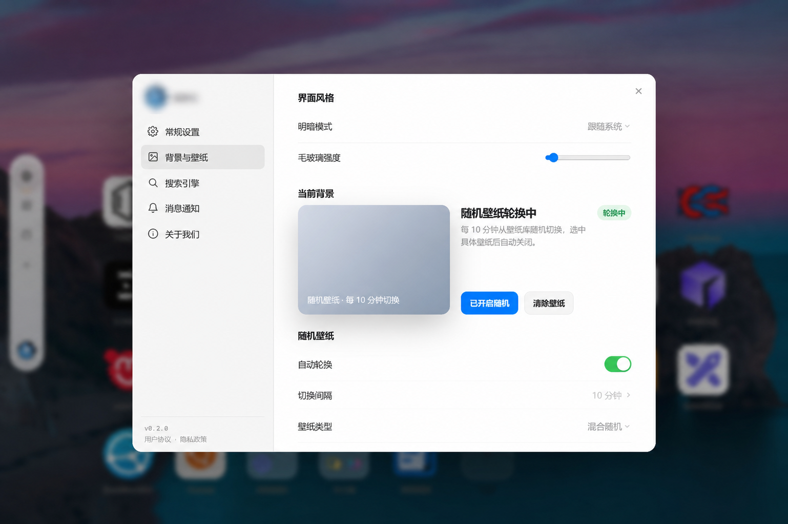

# 四、壁纸库

> **对应代码**：`backend/src/handlers/wallpapers.rs`、`backend/src/handlers/upload.rs`、`backend/src/scraper/`、`frontend/src/components/Background.tsx`、`frontend/src/hooks/useWallpaperShuffle.ts`、`frontend/src/hooks/usePinnedWallpaper.ts`
> **维护提示**：修改壁纸来源、抓取策略或 CDN 加速逻辑时同步更新本文档。

NavHub 的壁纸库模块提供丰富的背景壁纸资源，支持多来源抓取、本地存储、随机轮换等功能。壁纸可以作为导航页的背景，提升视觉体验。



## 1、壁纸数据模型

### 1.1 壁纸来源（WallpaperSource）

| 字段 | 类型 | 说明 |
|------|------|------|
| `id` | UUID | 来源唯一标识 |
| `name` | String | 来源名称（如 "Bing 每日"、"Unsplash"） |
| `site_url` | String | 来源网站 URL |
| `enabled` | bool | 是否启用自动抓取 |
| `fetch_batch_size` | i32 | 每批抓取数量 |
| `cache_ttl_hours` | i32 | 缓存有效期（小时） |
| `fetch_interval_hours` | i32 | 抓取间隔（小时） |
| `source_type` | String | 来源类型（`wallpaper` / `icon`） |
| `scraper_type` | String | 抓取器类型（`bing` / `unsplash` / `wallhaven` 等） |
| `last_fetched_at` | Timestamp? | 上次抓取时间 |
| `total_fetched` | i32 | 已抓取总数 |

### 1.2 远程壁纸（RemoteWallpaper）

| 字段 | 类型 | 说明 |
|------|------|------|
| `id` | UUID | 壁纸唯一标识 |
| `source_id` | UUID | 所属来源 ID |
| `title` | String? | 壁纸标题 |
| `original_url` | String | 原始 URL |
| `page_url` | String? | 来源页面 URL |
| `storage_key` | String? | MinIO 存储键（本地化后） |
| `thumbnail_key` | String? | 缩略图存储键 |
| `thumbnail_url` | String? | 缩略图 URL |
| `media_type` | String | 媒体类型：`image` / `video` |
| `file_size_bytes` | i64? | 文件大小（字节） |
| `width` / `height` | i32? | 图片尺寸 |
| `author` | String? | 作者 |
| `fetched_at` | Timestamp | 抓取时间 |
| `expires_at` | Timestamp? | 过期时间 |
| `is_active` | bool | 是否激活 |

### 1.3 前端视图类型

```typescript
// frontend/src/types.ts
interface RemoteWallpaperItem {
  id: string;
  sourceId: string;
  sourceName?: string | null;
  title: string | null;
  url: string;              // 同源稳定地址：/uploads/<storage_key>
  thumbnailUrl: string | null;
  pageUrl: string | null;
  mediaType: "video" | "image";
  author: string | null;
  fileSizeBytes?: number | null;
}

interface PublicWallpaperSource {
  id: string;
  name: string;
  sourceType: string;
  scraperType: string;
  totalCount: number;  // 该来源的可用壁纸数
}
```

## 2、壁纸来源

### 2.1 内置来源

NavHub 内置多种壁纸来源，通过不同的 Scraper 抓取：

| 来源 | Scraper | 说明 | 数据源 |
|------|---------|------|--------|
| Bing 每日壁纸 | `bing` | Bing 搜索首页每日更换的高清壁纸 | Bing API |
| Unsplash | `unsplash` | 全球知名免费图库 | Unsplash API |
| Wallhaven | `wallhaven` | 高质量壁纸社区 | Wallhaven API |
| Pexels | `pexels` | 免费高质量图片和视频 | Pexels API |
| Pixabay | `pixabay` | 免费图片、视频、音乐 | Pixabay API |
| NASA | `nasa` | NASA 每日天文图片 | NASA APOD API |
| Wikimedia | `wikimedia` | 维基共享资源 | Wikimedia API |
| DesktopHut | `desktophut` | 动态壁纸 | DesktopHut 网站 |

### 2.2 Scraper 架构

```
┌─────────────────────────────────────────────────────┐
│ Admin 管理台                                         │
│  POST /api/admin/wallpaper-sources/:id/fetch        │
└───────────────────────┬─────────────────────────────┘
                        │
                        ▼
┌─────────────────────────────────────────────────────┐
│ Scraper 调度器 (backend/src/tasks.rs)               │
│  定时任务：遍历所有 enabled 来源                      │
│  按 fetch_interval_hours 控制抓取频率                │
└───────────────────────┬─────────────────────────────┘
                        │
                        ▼
┌─────────────────────────────────────────────────────┐
│ Scraper 实现 (backend/src/scraper/)                 │
│  ┌─────────┐  ┌──────────┐  ┌──────────────┐       │
│  │ bing.rs │  │unsplash.rs│  │ wallhaven.rs │  ...  │
│  └────┬────┘  └─────┬────┘  └──────┬───────┘       │
│       │             │              │                │
│       ▼             ▼              ▼                │
│  下载图片 → 存储到 MinIO → 写入 remote_wallpapers   │
└─────────────────────────────────────────────────────┘
```

### 2.3 添加自定义来源

管理员可通过管理台添加自定义壁纸来源：

```
POST /api/admin/wallpaper-sources
{
  "name": "自定义来源",
  "siteUrl": "https://example.com",
  "scraperType": "custom",
  "fetchBatchSize": 20,
  "cacheTtlHours": 72,
  "fetchIntervalHours": 24
}
```

## 3、壁纸存储与 CDN

### 3.1 存储架构

```
┌──────────┐    抓取下载    ┌──────────┐    本地存储    ┌──────────┐
│ 外部来源  │ ────────────→ │ Scraper  │ ────────────→ │  MinIO   │
│ (API)    │               │          │               │ (S3 兼容) │
└──────────┘               └──────────┘               └──────────┘
                                                            │
                                                            ▼
                                                     ┌──────────┐
                                                     │ storage_key│
                                                     │ (对象键)   │
                                                     └──────────┘
```

**MinIO 存储键格式**：
- 壁纸：`wallpapers/<source_id>/<uuid>.<ext>`
- 缩略图：`wallpapers/<source_id>/thumb/<uuid>.<ext>`

### 3.2 稳定地址与临时签名

公开壁纸 API 返回同源稳定地址 `/uploads/<storage_key>`。浏览器请求该地址时，后端再生成当前有效的 S3 预签名地址并以临时重定向响应，同时设置 `Cache-Control: no-store`，避免把带过期签名的地址持久化到用户偏好或本地缓存。

前端持久化壁纸时以 `wallpaperId` 和稳定地址为准；如果检测到历史数据中包含 `X-Amz-Signature`、`X-Amz-Credential` 等临时参数，会丢弃旧缓存，并通过 `GET /api/wallpapers/:id` 重新解析该壁纸。这样即使 S3 签名过期，刷新或下次启动也不会长期停留在主题底色。

### 3.3 CDN 加速

NavHub 支持通过 Cloudflare CDN 加速壁纸分发：

```
用户请求壁纸
     │
     ▼
┌──────────┐    Cache HIT     ┌──────────┐
│Cloudflare│ ────────────────→│ 用户浏览器│
│   CDN    │                  └──────────┘
└──────────┘
     │ Cache MISS
     ▼
┌──────────┐    反向代理    ┌──────────┐
│ Nginx    │ ──────────────→│  MinIO   │
└──────────┘               └──────────┘
```

**CDN 配置要点**：
- 壁纸图片设置长缓存（`Cache-Control: max-age=31536000`）
- 使用内容哈希作为文件名，确保缓存一致性
- 缩略图使用独立的 CDN 路径，便于单独刷新

### 3.4 本地化存储的优势

| 对比项 | 本地化存储（MinIO） | 直接引用原始 URL |
|--------|-------------------|----------------|
| 加载速度 | 快（CDN 加速） | 慢（跨境网络） |
| 可靠性 | 高（本地副本） | 低（源站可能失效） |
| 隐私 | 无第三方追踪 | 可能有追踪 |
| 离线可用 | ✅ | ❌ |
| GFW 兼容 | ✅ | ❌（部分源被墙） |

## 4、随机轮换

### 4.1 用户配置

用户可在偏好设置中配置壁纸轮换：

```typescript
interface Tweaks {
  wallpaperId?: string;           // 当前壁纸 ID
  wallpaperName?: string;         // 壁纸名称
  wallpaperUrl?: string;          // 壁纸 URL
  wallpaperThumb?: string;        // 缩略图 URL
  wallpaperProvider?: string;     // 来源名称
  wallpaperProviderUrl?: string;  // 来源页面
  wallpaperSourceUrl?: string;    // 原始来源 URL
  wallpaperLicense?: string;      // 许可证
  wallpaperAuthor?: string;       // 作者
  wallpaperPosterUrl?: string;    // 视频封面
  wallpaperShuffle?: boolean;     // 是否启用随机轮换
  wallpaperShuffleInterval?: number; // 轮换间隔（分钟）
  wallpaperShuffleMediaType?: "" | "image" | "video"; // 媒体类型过滤
  wallpaperShuffleSource?: string; // 来源过滤
}
```

### 4.2 轮换机制

```
┌─────────────────────────────────────────────────────┐
│ 前端轮换逻辑                                         │
│                                                      │
│  setInterval(() => {                                │
│    if (wallpaperShuffle) {                           │
│      // 1. 从后端获取随机壁纸                         │
│      // 2. 预加载新壁纸                              │
│      // 3. 淡入淡出切换背景                           │
│    }                                                 │
│  }, wallpaperShuffleInterval * 60 * 1000);           │
└─────────────────────────────────────────────────────┘
```

**轮换策略**：
- **间隔可配置**：默认 30 分钟，范围 5-1440 分钟
- **媒体类型过滤**：可选仅图片、仅视频或全部
- **来源过滤**：可选特定来源或全部来源
- **预加载与恢复**：切换前加载缩略图和原图；失败时按退避策略重试，只有图片真正加载并解码成功后才切换背景

### 4.3 推送分类壁纸

管理员可以为推送分类指定默认壁纸：

```
POST /api/admin/groups/:id/push
{
  "wallpaperId": "uuid",
  "wallpaperUrl": "https://..."
}
```

用户收到推送分类时，会自动应用该壁纸（存储在 `user_preferences.pushed_group_wallpapers`）。

## 5、壁纸列表 API

### 5.1 公开接口

**API 端点**：`GET /api/wallpapers`

**查询参数**：

| 参数 | 类型 | 说明 |
|------|------|------|
| `limit` | i64 | 每页数量（默认 24，最大 100） |
| `offset` | i64 | 偏移量 |
| `mediaType` | String | 媒体类型过滤 |
| `sourceId` | UUID | 来源过滤 |
| `q` | String | 标题搜索 |

**特殊过滤**（[wallpapers.rs#L77-L96](../../backend/src/handlers/wallpapers.rs)）：
- 仅返回 `is_active = true` 的壁纸
- 仅返回 `storage_key IS NOT NULL` 的壁纸（已本地化）
- 仅返回未过期的壁纸（`expires_at IS NULL OR expires_at > now()`）

**设计决策**：Guest 用户看不到未本地化的壁纸（`storage_key IS NULL`），因为这些壁纸会直接引用原始外部 URL，在 GFW 环境下可能无法访问。

### 5.2 固定壁纸解析

**API 端点**：`GET /api/wallpapers/:id`

根据壁纸 UUID 返回一条当前仍有效且已经本地化的壁纸记录。该接口主要用于恢复旧版偏好中的临时签名地址，以及固定壁纸启动时获取最新稳定地址；不存在、已停用、未本地化或已过期时返回 `404`。

### 5.3 来源列表

**API 端点**：`GET /api/wallpaper-sources`

返回所有有缓存壁纸的公开来源（`PublicWallpaperSource`）。

## 6、管理台功能

### 6.1 来源管理

| 操作 | API 端点 | 说明 |
|------|----------|------|
| 列表 | `GET /api/admin/wallpaper-sources` | 所有来源（含禁用） |
| 创建 | `POST /api/admin/wallpaper-sources` | 添加新来源 |
| 更新 | `PATCH /api/admin/wallpaper-sources/:id` | 修改配置 |
| 删除 | `DELETE /api/admin/wallpaper-sources/:id` | 删除来源 |
| 触发抓取 | `POST /api/admin/wallpaper-sources/:id/fetch` | 手动触发 |
| 上传壁纸 | `POST /api/admin/wallpaper-sources/:id/upload` | 手动上传 |

### 6.2 壁纸管理

| 操作 | API 端点 | 说明 |
|------|----------|------|
| 列表 | `GET /api/admin/remote-wallpapers` | 所有壁纸（含未激活） |
| 更新 | `PATCH /api/admin/remote-wallpapers/:id` | 修改属性 |
| 删除 | `DELETE /api/admin/remote-wallpapers/:id` | 删除壁纸 |

### 6.3 手动上传

管理员可手动上传壁纸到指定来源：

```
POST /api/admin/wallpaper-sources/:id/upload
Content-Type: multipart/form-data

file: <binary>
```

上传限制：200MB（在路由层配置 `DefaultBodyLimit`）。

## 7、前后端交互总结

| 操作 | 触发方式 | API 端点 |
|------|----------|----------|
| 浏览壁纸 | 壁纸选择器 | `GET /api/wallpapers` |
| 恢复固定壁纸 | 启动时按壁纸 ID 解析 | `GET /api/wallpapers/:id` |
| 查看来源 | 来源筛选 | `GET /api/wallpaper-sources` |
| 设置壁纸 | 选择壁纸 → 保存偏好 | `PATCH /api/me/preferences` |
| 启用轮换 | 偏好设置 | `PATCH /api/me/preferences` |
| 管理来源 | 管理台 | `POST/PATCH/DELETE /api/admin/wallpaper-sources` |
| 管理壁纸 | 管理台 | `GET/PATCH/DELETE /api/admin/remote-wallpapers` |
| 手动抓取 | 管理台按钮 | `POST /api/admin/wallpaper-sources/:id/fetch` |
| 手动上传 | 管理台上传 | `POST /api/admin/wallpaper-sources/:id/upload` |

---
- 上一篇：[小组件.md](./小组件.md)
- 下一篇：[网格系统.md](./网格系统.md)
- 返回索引：[docs/wiki/README.md](../README.md)
